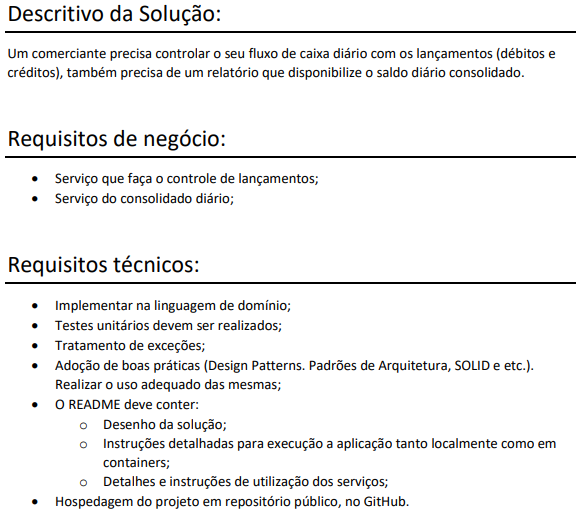
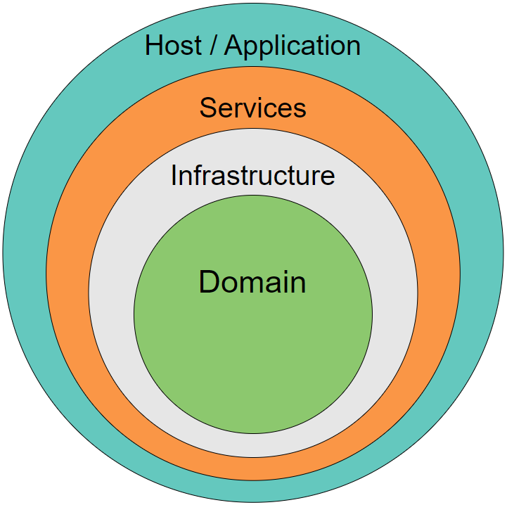
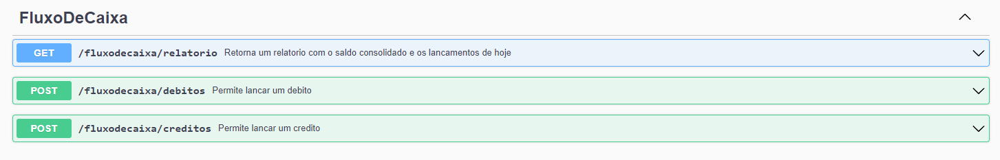

# Desafio


 
 # Desenho da solução



# Build

## Container

Tendo o [Docker](https://www.docker.com/products/docker-desktop/) instalado execute o comando na raiz do projeto

```bash
docker-compose up
```

## Local

Para executar localmente é necessário um [sqlserver](https://www.microsoft.com/pt-br/sql-server/sql-server-downloads) de pé e o [sdk do dotnet](https://dotnet.microsoft.com/en-us/download/dotnet/thank-you/runtime-aspnetcore-7.0.15-windows-hosting-bundle-installer) instalado.

* Configure a connection string do seu sqlserver no arquivo appsettings.json localizado em 

```bash
└───src
    ├───Host
    │   ├───appsettings.json
```

* Abra um terminal na mesma pasta do appsettings.json e execute o comando
```bash
dotnet run
```

# Utilizando a aplicação

* Para obter o relatório com o saldo consolidado e os lançamentos de hoje
```
curl -X 'GET' 'http://localhost:8000/fluxodecaixa/relatorio' -H 'accept: text/plain'
```

* Para lançar um débito
```
curl -X 'POST' \
  'http://localhost:8000/fluxodecaixa/debitos' \
  -H 'accept: text/plain' \
  -H 'Content-Type: application/json' \
  -d '{
  "valor": "100.50"
}'
```

* Para lançar um crédito
```
curl -X 'POST' \
  'http://localhost:8000/fluxodecaixa/creditos' \
  -H 'accept: text/plain' \
  -H 'Content-Type: application/json' \
  -d '{
  "valor": "100.50"
}'
```

#### Tambem é possível utilizar a aplicação via swagger acessando

```url
http://localhost:8000/swagger/index.html
```

As rotas são RESTful e de uso intuitivo


